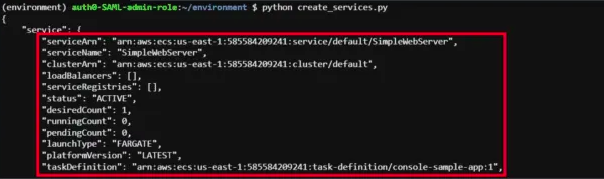

# DESCRIPTION

This template shows how to create and delete the service in ECS using the Boto3.

---

#### Prerequiste

* Install Python
* AWS Configure

### Steps

1. Open the folder in your terminal or any supported tool.
2. Run the following commands:

`python3 service-create-boto3.py`

`python3 service-delete-boto3.py`

---

### Outputs

<b>Service Create

Service Delete</b>

---
